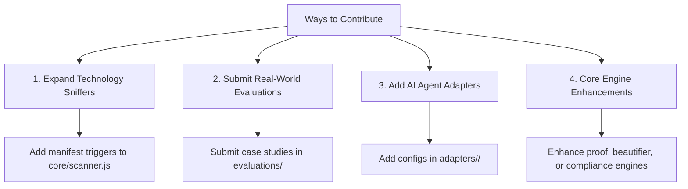

# 🤝 Contributing to README-Architect

Thank you for your interest in contributing to **README-Architect**!  
We welcome contributions from software developers, documentation engineers, tech writers, and open-source advocates worldwide.

---

## 🧭 Core Architectural Philosophy

Before contributing, please keep in mind our five founding principles:

1. **Anti-Hallucination & Proof-Driven**: Documentation must reflect ground truth. Every suggested build command, port number, and environment variable must be verified against actual project manifests.
2. **Visual Excellence & Wow Factor**: We avoid generic, bland READMEs. Every generated document uses curated color palettes, centered hero headers, and beautifully formatted Unicode directory trees.
3. **Zero Runtime Dependencies**: The core engine is built purely on native Node.js (ESM), with zero third-party production dependencies.
4. **Accessibility First (WCAG 2.2 AA)**: Badges must have meaningful alt text, tables must be screen-reader friendly, and visual diagrams must have descriptive textual fallbacks.
5. **Cross-Registry Parity**: Documentation must render flawlessly across GitHub, npmjs.com, and PyPI without broken HTML or distorted alert blocks.

---

## 🛠️ 4 Ways You Can Contribute



### 1. Expand Technology & Manifest Sniffers (`core/scanner.js`)
Help `readme-architect` recognize more frameworks, package managers, and cloud tools:
- **Location**: [`core/scanner.js`](./core/scanner.js)
- **What to add**:
  - Manifest detectors (e.g., Elixir `mix.exs`, Swift `Package.swift`, Rust `Cargo.toml`, Terraform `*.tf`).
  - Command sniffers (e.g., Turbo, Bun, Deno, Make).
  - Port and environment variable extractors.

### 2. Submit Real-World Evaluation RFCs (`evaluations/`)
Tested `readme-architect` on an unusual repository or monorepo where detection was incomplete?
- **Workflow**:
  1. Copy [`evaluations/TEMPLATE_FEEDBACK.md`](./evaluations/TEMPLATE_FEEDBACK.md).
  2. Document your real-world codebase structure, manifests, and missing sections.
  3. Submit a Pull Request.
- **Reference Example**: See [`evaluations/archive/CASE_01_COMPLIANCE_AND_BEAUTIFY_TUNING.md`](./evaluations/archive/CASE_01_COMPLIANCE_AND_BEAUTIFY_TUNING.md).

### 3. Add New AI Agent Adapters (`adapters/`)
`readme-architect` is designed to be agent-agnostic:
- **Location**: [`adapters/<agent_name>/`](./adapters/)
- **Current Adapters**: Antigravity, Cursor, Windsurf, Claude Code, GitHub Copilot, Cline, Continue.dev, Roo Code.
- If your favorite AI agent or IDE is missing, create a new adapter folder with the respective system prompt / rules configuration.

### 4. Enhance Core Engines (`core/`)
- [`core/scanner.js`](./core/scanner.js): Manifest detection, environment variable extraction, port resolution.
- [`core/proof.js`](./core/proof.js): Anti-hallucination command verification, secret sanitization, broken link cleaning.
- [`core/beautifier.js`](./core/beautifier.js): Hero header badges, Unicode directory trees, theme palettes.
- [`core/compliance.js`](./core/compliance.js): WCAG 2.2 AA scoring, broken link audits, SPDX 3.0 license verification.
- [`core/styles.js`](./core/styles.js): 12 distinct documentation writing styles (CLI tool, library, API service, academic, etc.).
- [`core/mcp_server.js`](./core/mcp_server.js): Model Context Protocol (MCP) JSON-RPC tool declarations.

---

## 💻 Local Development Setup

### Prerequisites
- **Node.js**: `>= 18.0.0`
- **Git**: Installed and configured

### Getting Started

1. **Fork and Clone the Repository**:
   ```bash
   git clone https://github.com/<your-username>/readme-architect.git
   cd readme-architect
   ```

2. **Verify Environment**:
   ```bash
   node --version # Must be >= 18.0.0
   ```

3. **Run the Automated Test Suite**:
   ```bash
   npm test
   ```
   *All 27+ tests must pass before you write new changes.*

4. **Test the CLI Locally**:
   ```bash
   node bin/readme-architect.js --help
   node bin/readme-architect.js scan .
   node bin/readme-architect.js compliance README.md
   ```

5. **Test the MCP Server Locally**:
   ```bash
   npm run mcp
   ```

---

## 🧪 Testing Guidelines

Whenever you add a feature or fix a bug:
1. Add a representative fixture in [`tests/fixtures/`](./tests/fixtures/) if a new language manifest or file scenario is introduced.
2. Add corresponding assertions in [`tests/test_all.js`](./tests/test_all.js).
3. Ensure **100% of test cases pass**:
   ```bash
   npm test
   ```

---

## 📝 Commit Message Convention

We follow the [Conventional Commits](https://www.conventionalcommits.org/) specification:

| Prefix | Description | Example |
|---|---|---|
| `feat:` | A new feature or capability | `feat(scanner): add Elixir Mix manifest sniffer` |
| `fix:` | A bug fix | `fix(beautifier): prevent redundant hero headers` |
| `docs:` | Documentation changes | `docs(readme): update bilingual evaluation guide` |
| `test:` | Adding or improving tests | `test(compliance): add test for SPDX 3.0 validation` |
| `chore:` | Maintenance tasks | `chore(release): bump version to 1.0.0` |

---

## 🚀 Pull Request (PR) Process

1. Create a dedicated branch from `main`:
   ```bash
   git checkout -b feat/my-new-feature
   ```
2. Make your changes adhering to project conventions.
3. Run test suite:
   ```bash
   npm test
   ```
4. Commit your changes with a clear message:
   ```bash
   git commit -m "feat(scanner): recognize Bun runtime and lockfile"
   ```
5. Push to your fork and open a **Pull Request** to `main`.
6. Describe the changes, motivation, and link any relevant evaluation documents from `evaluations/`.

---

## 📜 Code of Conduct

We are committed to providing a friendly, safe, and welcoming environment for everyone, regardless of background, gender, identity, experience level, or nationality. Please treat all contributors and maintainers with respect, professionalism, and constructive empathy.

---

## 💬 Questions or Feedback?

- Open an issue on GitHub: [Issues](https://github.com/hanifalkauni/readme-architect/issues)
- Submit an evaluation RFC: [`evaluations/TEMPLATE_FEEDBACK.md`](./evaluations/TEMPLATE_FEEDBACK.md)
- Repository: [https://github.com/hanifalkauni/readme-architect](https://github.com/hanifalkauni/readme-architect)
