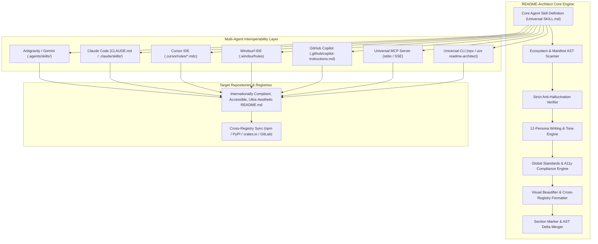
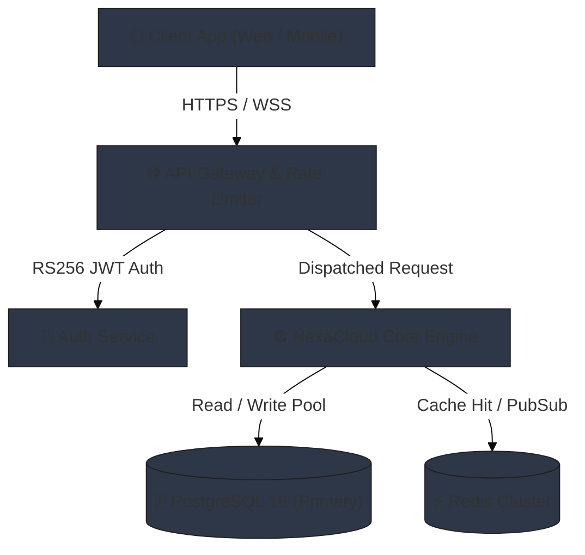
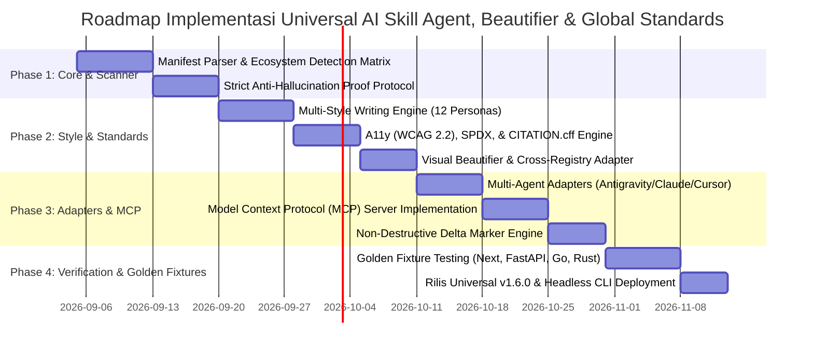

# Product Requirements Document (PRD)
## AI Skill Agent: "README-Architect" (Universal, Accurate, Comprehensive, Visually Stunning & Internationally Compliant README Generator)

---

| **Metadata** | **Spesifikasi** |
| :--- | :--- |
| **Nama Produk** | README-Architect (Universal AI Skill Agent with Visual Beautifier, 12-Style Personas & Global Standards Engine) |
| **Versi Dokumen** | v1.6.0 |
| **Status** | Approved / Ready for Development |
| **Target Platform** | **Universal Multi-Agent Ecosystem**:<br>• Google Antigravity & Gemini CLI (`.agents/skills/`, `AGENTS.md`)<br>• Anthropic Claude Code & Claude Desktop (`CLAUDE.md`, `.claude/skills/`, MCP)<br>• Cursor IDE (`.cursor/rules/*.mdc`, `.cursorrules`)<br>• Windsurf IDE (`.windsurfrules`)<br>• GitHub Copilot & Workspace (`.github/copilot-instructions.md`)<br>• Universal Model Context Protocol (MCP) Clients (Zed, Continue, Sourcegraph)<br>• Aider, OpenHands, SWE-agent (`CONVENTIONS.md`)<br>• Standalone Headless CLI (`npx readme-architect` / `uvx readme-architect`) |
| **Target Pengguna** | Software Engineers, Open Source Maintainers, Tech Leads, DevOps & SRE Engineers, Security Auditors, Product Managers, Developer Advocates, Researchers |
| **Tanggal Rilis Target** | Q4 2026 |

---

## 1. Executive Summary & Problem Statement

### 1.1 Latar Belakang & Masalah
Dokumentasi repositori (`README.md`) adalah etalase dan pintu gerbang utama proyek perangkat lunak. Namun, mayoritas repositori menghadapi kendala serius:
1. **Tampilan Kering, Membosankan, & Sulit Dibaca**: Banyak README hanya berisi teks monolitik tanpa hierarki visual, tanpa kontras warna, tabel berantakan, dan tidak memiliki "daya pikat pertama" (*poor first impression*).
2. **Ketiadaan Fleksibilitas Gaya Penulisan (One Size Fits None)**: Kebutuhan repositori berbeda drastis antara internal platform (*developer-centric*), SaaS (*product-oriented*), infra (*devops-infra*), gateway (*api-first*), audit (*security-first*), CLI (*cli-tool*), maupun riset (*academic*).
3. **Kerusakan Tampilan di Multi-Registry**: Sintaks markdown yang dibuat khusus untuk GitHub (seperti alert `> [!NOTE]` atau tag `<picture>`) sering kali **rusak atau menjadi teks mentah berantakan** saat paket di-publish ke npmjs.com, PyPI, crates.io, atau dibuka di GitLab dan Bitbucket.
4. **Pelanggaran Aksesibilitas (A11y)**: Mayoritas README memiliki badge kosong tanpa teks alternatif (`[]`), tabel yang tidak ramah pembaca layar (*screen reader*), dan diagram Mermaid visual tanpa representasi tekstual bagi tunanetra (tidak patuh WCAG 2.2).
5. **Ketiadaan Standar Kepatuhan Internasional**: Kurangnya penanda lisensi mesin (*SPDX & REUSE*), format sitasi ilmiah standar (`CITATION.cff`), etika kontributor (*All-Contributors*), serta kepatuhan rantai pasok (*OpenSSF*).
6. **Outdated, Incomplete & Rawan Halusinasi**: Lebih dari 70% repositori memiliki langkah instalasi usang atau mengarang perintah fiktif karena penggunaan LLM biasa tanpa validasi manifest.

### 1.2 Visi Produk
Menciptakan **Universal AI Skill Agent** otonom bernama **`README-Architect`** yang memadukan **inspeksi kode statis tanpa halusinasi**, **Visual Beautification Engine**, **12 Persona Gaya Penulisan**, serta **Kepatuhan Penuh terhadap Standar Internasional** (WCAG 2.2 AA, Diátaxis, SPDX/REUSE, Cross-Registry Parity, CITATION.cff, All-Contributors, OpenSSF)—menghasilkan dokumentasi yang elegan, inklusif, akurat 100%, dan siap produksi.

### 1.3 Nilai Kunci (Core Value Propositions)
- **International Standards & Accessibility Compliance**:
  - *WCAG 2.2 Level AA*: Aksesibilitas penuh dengan mandatory alt-text dan ringkasan tekstual untuk diagram visual.
  - *Cross-Registry Parity*: Jaminan tampilan bersih tanpa broken-tags di GitHub, GitLab, Bitbucket, npmjs, PyPI, dan crates.io (*Graceful Degradation*).
  - *SPDX & REUSE Spec*: Penandaan lisensi standar industri yang ramah audit mesin.
  - *CITATION.cff*: Integrasi file sitasi akademik otomatis yang memicu tombol native "Cite this repository" di GitHub.
  - *All-Contributors Spec*: Pengakuan kontributor komprehensif (kode, desain, dokumentasi, ide, bug).
  - *OpenSSF Best Practices*: Postur keamanan rantai pasok dan integrasi tautan `SECURITY.md`.
- **Configurable Writing Styles & Personas (12 Pilihan Gaya)**: *Showcase, Developer-Centric, Product-Oriented, DevOps-Infra, API-First, Security-First, CLI-Tool, Storytelling, Minimalist, Enterprise, Tutorial, Academic*.
- **Aesthetic Excellence ("Beautify Engine")**: Hero header modern, dual dark/light mode banner, Shields.io badges berpalet harmonis (Catppuccin/Tokyo Night/Nord), kartu fitur interaktif, dan diagram arsitektur Mermaid bertema cantik.
- **Zero-Hallucination Guarantee**: Verifikasi silang wajib terhadap setiap perintah instalasi, script dev, dan flag CLI langsung ke file manifest dan source code.
- **Universal Multi-Agent Interoperability**: Satu definisi inti (*Single Source of Truth*) yang otomatis kompatibel dengan Antigravity, Claude Code, Cursor, Windsurf, Copilot, MCP Server, dan CLI.
- **Smart Delta Update (Non-Destructive)**: Sistem marker section untuk memperbarui bagian otomatis tanpa menimpa catatan kustom milik pengembang.

---

## 2. User Personas & Use Cases

### 2.1 User Personas

| Persona | Role | Primary Standard Needed | Ekspektasi terhadap README-Architect |
| :--- | :--- | :--- | :--- |
| **Package Publisher** | npm / PyPI / Crates Maintainer | **Cross-Registry Parity** | README tampil sempurna di repositori git dan halaman paket npm/PyPI tanpa tag HTML rusak. |
| **Accessibility Advocate** | Inclusive Tech Lead | **WCAG 2.2 A11y** | Seluruh badge, tabel, dan diagram Mermaid dapat dinavigasi dengan nyaman oleh pengguna screen reader. |
| **Senior Architect / Core Dev** | Framework & Library Author | **Developer-Centric & SPDX** | Keputusan arsitektur mendalam, type contracts, debugging runbooks, dan lisensi SPDX standar mesin. |
| **Product Manager / Founder** | SaaS & App Builder | **Product-Oriented** | Menonjolkan proposisi nilai, pain points, alur user journey, dan Use Cases bisnis nyata. |
| **DevOps & Platform Lead** | SRE & Cloud Architect | **DevOps-Infra & OpenSSF** | Topologi Kubernetes/Terraform, health check probes, monitoring Prometheus, dan skor keamanan OpenSSF. |
| **API Architect & SDK Lead** | Gateway & Integration Engineer | **API-First & Diátaxis** | Kontrak schema JSON/Protobuf, header auth, kamus response status codes, dan SDK usage syntax. |
| **Security Engineer & Auditor** | DevSecOps & CISO Team | **Security-First & REUSE** | Pemetaan Threat Modeling, SBOM, compliance SOC2/ISO, dan Vulnerability Disclosure Policy. |
| **Terminal & Systems Hacker** | CLI Utility Developer | **CLI-Tool & Man-Page** | Tabel flags, cheatsheet piping UNIX, shell completions (Zsh/Fish), dan daftar Exit Codes. |
| **AI / ML Researcher** | Research Scientist | **Academic & CITATION.cff** | Format blok sitasi BibTeX resmi, file `CITATION.cff` otomatis, dan tabel benchmark reproduktif. |
| **Community Manager** | Open Source Advocate | **All-Contributors Spec** | Pengakuan adil bagi seluruh kontributor (non-kode dan kode) dalam matriks emoji terstandarisasi. |

---

## 3. Product Architecture & Multi-Agent Interoperability



---

## 4. Functional Requirements (FR)

### FR-1: Ekosistem & Manifest Detection Matrix

Agent wajib mengidentifikasi ekosistem teknologi secara otomatis berdasarkan kehadiran file manifest dan lockfile:

| Ekosistem | File Manifest Acuan | Lockfile & Package Manager Resolver | Perintah Dev/Run Default |
| :--- | :--- | :--- | :--- |
| **Node.js / TS** | `package.json`, `tsconfig.json` | `bun.lockb` (`bun`), `pnpm-lock.yaml` (`pnpm`), `yarn.lock` (`yarn`), `package-lock.json` (`npm`) | Berdasarkan `scripts.dev` atau `scripts.start` |
| **Python** | `pyproject.toml`, `setup.py`, `requirements.txt` | `poetry.lock` (`poetry`), `Pipfile.lock` (`pipenv`), `requirements.txt` (`pip`) | `poetry run python ...` atau `uv run ...` |
| **Go** | `go.mod`, `go.sum` | `go.mod` (`go mod download`) | `go run .` atau `go run ./cmd/...` |
| **Rust** | `Cargo.toml` | `Cargo.lock` (`cargo build`) | `cargo run` |
| **Java / Kotlin** | `pom.xml`, `build.gradle`, `build.gradle.kts` | Maven Wrapper (`./mvnw`), Gradle Wrapper (`./gradlew`) | `./gradlew bootRun` / `mvn spring-boot:run` |
| **PHP** | `composer.json` | `composer.lock` (`composer install`) | `php artisan serve` / `composer start` |
| **Container & IaC** | `Dockerfile`, `docker-compose.yml`, `main.tf`, `Chart.yaml` | Service port definition, Terraform providers, Helm values | `docker compose up -d` / `terraform apply` |

### FR-2: Strict Anti-Hallucination Proof Verification Protocol

Untuk menjamin akurasi 100% tanpa halusinasi, agent wajib mematuhi 4 langkah pembuktian:
1. **Step 1 - Command Proofing**: Setiap perintah terminal harus dapat dilacak langsung ke key `scripts` di `package.json`, targets di `Makefile`, atau CLI standar framework.
2. **Step 2 - Flag Validation**: Flag CLI harus dibuktikan dari kode parser argumen (`argparse`, `commander`, `cobra`, `clap`).
3. **Step 3 - Port & Host Resolution**: Prioritas: `.env.example` -> Hardcoded fallback di kode -> Standar framework dengan label *"(default framework port)"*.
4. **Step 4 - Negative Assertion (Strict Fallback)**: Jika suatu perintah tidak dapat dibuktikan, agent **DILARANG MENGARANG**. Wajib menggunakan anotasi `> [!IMPORTANT]` atau meminta klarifikasi pengguna.

### FR-3: Visual Beautification & Aesthetics Engine ("Enak Dipandang")

| ID | Fitur Beautification | Deskripsi Rinci & Implementasi | Prioritas |
| :--- | :--- | :--- | :--- |
| **FR-3.1** | Hero Header & Tagline Banner | Header tengah (`<div align="center">`) dengan judul tipografi tegas, logo resmi / icon tematik, tagline elegan, serta separator gradien halus. | P0 (Kritis) |
| **FR-3.2** | Curated Color Badges | Membangun badge Shields.io dengan palet warna terkurasi (Catppuccin Mocha, Tokyo Night, Nord, Minimalist Charcoal), logo SimpleIcons resmi, dan gaya `for-the-badge` atau `flat-square`. | P0 (Kritis) |
| **FR-3.3** | Dual Theme Support (Dark & Light) | Menggunakan tag `<picture>` GitHub agar gambar banner, arsitektur, atau logo berganti otomatis sesuai preferensi mode gelap/terang pengguna. | P1 (Tinggi) |
| **FR-3.4** | Feature Grid Cards | Menampilkan daftar fitur dalam bentuk tabel grid modern dengan ikon representatif, status pills, dan deskripsi singkat berbobot. | P1 (Tinggi) |
| **FR-3.5** | Styled Mermaid Diagrams | Diagram Mermaid dengan konfigurasi styling tema konsisten (node bergradien, konektor halus, label terbaca jelas). | P0 (Kritis) |
| **FR-3.6** | Annotated Directory Tree | Pohon direktori menggunakan karakter Unicode (`├──`, `└──`) dilengkapi emoji indikator (`📁`, `⚙️`, `🧪`, `🐳`) dengan batas kedalaman maksimal 3 level. | P1 (Tinggi) |
| **FR-3.7** | Interactive Collapsible Deep-Dives | Pemanfaatan kartu `<details><summary>` berformat rapi untuk detail JSON payload, log ekstensif, dan argumen CLI lanjutan tanpa membuat halaman sesak. | P0 (Kritis) |
| **FR-3.8** | Keyboard Shortcut & Status Badges | Menggunakan elemen `<kbd>` dan status badges (``) pada tabel API dan konfigurasi. | P2 (Sedang) |
| **FR-3.9** | GFM Native Alerts Hierarchy | Penggunaan terstruktur untuk `> [!NOTE]`, `> [!TIP]`, `> [!IMPORTANT]`, `> [!WARNING]`, dan `> [!CAUTION]`. | P0 (Kritis) |

---

### FR-4: Configurable Writing Styles & Tone Personas Engine (12 Gaya Pilihan)

Pengguna dapat memilih gaya penulisan secara opsional (melalui parameter CLI `--style`, config JSON, atau instruksi prompt). Agen wajib mendukung 12 profil gaya berikut:

| Style ID | Nama Gaya | Karakteristik Nada & Diksi | Format & Kepadatan Konten | Rekomendasi Penggunaan |
| :--- | :--- | :--- | :--- | :--- |
| `showcase` *(Default)* | **Community & Open Source** | Antusias, inspiratif, menyambut kontributor, naratif tentang visi proyek. | Kaya badge warna-warni, hero banner tengah, GIF/demo link, card grid fitur, dan tombol kontribusi. | Repositori publik, proyek open-source, aplikasi portofolio, hackathon. |
| `developer-centric` | **Deep Technical & DX** | Engineer-to-engineer, presisi arsitektural, berfokus pada Developer Experience (DX), type-safety, dan ekstensibilitas. | Diagram arsitektur mendalam, cuplikan interface/type contract, benchmark latensi/memori, panduan debugging & profiling, hooks ekstensibilitas. | Framework, SDK, core libraries, backend internal platform, microservice core. |
| `product-oriented` | **Value-Driven & Business Impact** | Berorientasi solusi dan manfaat nyata, fokus pada "Pain Points Solved", persona pengguna, dan dampak bisnis. | Matriks masalah-solusi ("Problem vs Solution"), use cases riil lintas departemen/tim, perbandingan Before-After, benefit-driven feature cards. | SaaS applications, produk digital web/mobile, marketplace, startup MVP tools. |
| `devops-infra` | **Infrastructure, SRE & Operations** | Berfokus pada stabilitas operasional, topologi deployment, dan observabilitas (*zero hand-waving*). | Topologi K8s/Helm/Terraform, monitoring Prometheus/Grafana, health check probes (`/healthz`), resource limits, dan Disaster Recovery runbook. | Helm charts, Terraform modules, Kubernetes operators, Docker stacks, platform engineering. |
| `api-first` | **API & SDK Contract Reference** | Terstruktur seperti dokumentasi Stripe/OpenAPI; mengutamakan kontrak data dan interoperabilitas. | Matriks endpoints REST/gRPC, header auth wajib, kamus status code HTTP & error JSON, dan multi-language SDK call snippets. | API Gateways, REST/GraphQL microservices, client SDKs, webhook receivers. |
| `security-first` | **DevSecOps, Hardened & Audit-Ready** | Sangat peduli pada postur keamanan, kepatuhan, privasi data, dan transparansi kerentanan. | Threat Model matrix, SBOM, standar enkripsi (AES-GCM, Argon2), Least Privilege Access Matrix, dan Vulnerability Disclosure Policy. | Auth libraries, sistem kripto/blockchain, security tools, perbankan bersertifikasi SOC2/ISO. |
| `cli-tool` | **Terminal Utility & Man-Page** | Terinspirasi man-page UNIX; efisiensi baris perintah, piping, dan cheatsheet cepat. | Pola sintaks command, tabel flags (`-v`, `--verbose`), contoh UNIX piping (`grep ... \| tool`), shell auto-completions, dan exit codes. | CLI tools, terminal utilities (seperti `ripgrep`, `fzf`, `gh`, `kubectl` plugins). |
| `storytelling` | **Philosophy & Disruptive Manifesto** | Naratif berani (*bold*), radikal, berpendapat kuat (*opinionated*), mengisahkan frustrasi terhadap status quo. | Bagian *"Why We Built This"*, filosofi desain fundamental, komparasi performa ekstrem terhadap alternatif populer. | Proyek open-source viral, framework alternatif revolusioner (seperti Bun, HTMX, Astro). |
| `minimalist` | **Developer-First & Terse** | Dingin, to-the-point, tanpa basa-basi, nol marketing fluff, fokus sintaks murni. | Tanpa hero banner besar, badge minimal (versi & build saja), langsung `git clone` & perintah, tabel flag CLI ringkas. | Internal tools, microservices kecil, CLI tools, library teknis utilitas. |
| `enterprise` | **Corporate & Governance** | Formal, otoritatif, berbobot, berfokus pada kepatuhan, keandalan, dan SLA. | Penekanan pada arsitektur kepatuhan (SOC2, GDPR), matriks peran pengguna (RBAC), disaster recovery, dan audit logging. | Fintech, banking apps, healthcare, B2B enterprise SaaS, sistem regulasi ketat. |
| `tutorial` | **Educational & Explanatory** | Ramah pemula, mengayomi, edukatif, menerangkan konsep di balik setiap langkah. | Penjelasan detail prasyarat (contoh: cara install Docker bagi pemula), anotasi tiap baris konfigurasi, tips troubleshooting preventif. | Template starter kits, repositori tutorial, course materials, SDK multi-tingkat keahlian. |
| `academic` | **Research & Scientific** | Akademis, presisi matematis, berbasis metodologi dan data empiris. | Menyertakan blok sitasi BibTeX resmi, file `CITATION.cff`, tabel komparasi benchmark, link dataset, dan instruksi reproduksibilitas. | Model AI/Machine Learning, repositori paper ilmiah, algoritma komputasi sains. |

---

### FR-5: Non-Destructive Delta Update Engine (Marker System)

Untuk memperbarui README tanpa menimpa catatan kustom pengembang:

```html
<!-- readme-architect:start(hero) -->
[Konten Header & Badges yang dikelola oleh agent]
<!-- readme-architect:end(hero) -->

<!-- user-content:start(custom-notes) -->
[Catatan manual pengembang, sponsor, donasi, atau kredit khusus - TIDAK AKAN DISENTUH]
<!-- user-content:end(custom-notes) -->

<!-- readme-architect:start(architecture) -->
[Diagram Mermaid yang diperbarui otomatis saat kode berubah]
<!-- readme-architect:end(architecture) -->
```

### FR-6: Monorepo & Multi-Package Architecture Support
- **Root README**: Menampilkan peta interkoneksi packages/apps dalam diagram Mermaid, tabel fungsi package, dan perintah global workspace (misal: `pnpm --filter @repo/web dev`).
- **Sub-Package README**: Dihasilkan di dalam `packages/<pkg-name>/README.md` berfokus pada ekspor API lokal.

### FR-7: Standar Struktur Blueprint 14 Bagian Komprehensif
1. **Hero Header, Logo & Accessible Badges** (Disesuaikan dengan style terpilih)
2. **Executive Overview & Problem Solved**
3. **Interactive Feature Grid Cards** (Orientasi Teknis, Manfaat Produk, atau Keamanan)
4. **Themed Architecture & Request Flow Diagram (Mermaid.js dengan Textual Summary)**
5. **Annotated Project Directory Tree**
6. **Tech Stack & Tooling Matrix**
7. **Prerequisites & Runtime Matrix**
8. **Step-by-Step Installation & Local Development**
9. **Environment Variables Specification (.env)**
10. **Usage Examples & Verified API Reference (Collapsible)**
11. **Testing & QA Workflows (Unit, E2E, Coverage)**
12. **Containerization & Deployment Guide (Docker / K8s)**
13. **Troubleshooting & Common Pitfalls FAQ**
14. **Community, Contributors, Security & License** (All-Contributors grid, Security Policy link, SPDX notation, & CITATION.cff link)

---

### FR-8: Global Industry Standards & Accessibility Compliance Engine *(Standarisasi Internasional Baru)*

| ID | Standar Global | Spesifikasi Implementasi Teknis | Prioritas |
| :--- | :--- | :--- | :--- |
| **FR-8.1** | **Cross-Registry Parity & Graceful Degradation** | Memastikan sintaks README tidak rusak saat di-publish ke registry paket non-GitHub (`npmjs.com`, `pypi.org`, `crates.io`, `packagist.org`) serta GitLab dan Bitbucket. Tag `<picture>` dan alert `> [!NOTE]` memiliki fallback sintaks murni CommonMark saat flag `--registry universal` aktif. | P0 (Kritis) |
| **FR-8.2** | **Aksesibilitas WCAG 2.2 Level AA (A11y)** | 1. **Mandatory Alt-Text**: Dilarang membuat badge kosong `[]`; setiap badge wajib memiliki alt-text fungsional (contoh: ``).<br>2. **Diagram Textual Fallback**: Setiap blok diagram Mermaid wajib menyertakan ringkasan alur teks naratif 1-2 kalimat di bawahnya untuk pengguna *screen reader*.<br>3. **Accessible Tables**: Tabel Markdown memiliki header kolom yang jelas tanpa sel kosong. | P0 (Kritis) |
| **FR-8.3** | **SPDX & REUSE Specification** | Menyertakan penanda lisensi standar mesin resmi: `SPDX-License-Identifier: <LICENSE-ID>` (misal `MIT`, `Apache-2.0`, `GPL-3.0-only`) serta pernyataan hak cipta terstandarisasi `Copyright (c) [Tahun] [Nama Entitas]` yang patuh pada standar FSFE REUSE. | P1 (Tinggi) |
| **FR-8.4** | **Citation File Format (CITATION.cff) & DOI** | Pada mode `academic` atau saat opsi sitasi aktif, agen otomatis menghasilkan file `CITATION.cff` (YAML standar The Turing Way/GitHub) dan menambahkan blok sitasi BibTeX resmi di footer README yang mengaktifkan tombol native *"Cite this repository"* di GitHub. | P1 (Tinggi) |
| **FR-8.5** | **All-Contributors Specification** | Mendukung pengakuan kontributor multi-dimensi (tidak hanya kontributor kode) menggunakan matriks emoji resmi All-Contributors (`code` 💻, `doc` 📖, `design` 🎨, `bug` 🐛, `ideas` 💡, `review` 👀, `translation` 🌍) dalam tabel grid rapi. | P1 (Tinggi) |
| **FR-8.6** | **OpenSSF Scorecard & Security Posture** | Menghasilkan tautan ke kebijakan keamanan `SECURITY.md`, kontak pengungkapan kerentanan privat (*Responsible Vulnerability Disclosure*), serta menyematkan badge resmi **OpenSSF Best Practices Scorecard** pada repositori publik/enterprise. | P1 (Tinggi) |

---

## 5. Non-Functional Requirements (NFR)

### 5.1 Akurasi & Keandalan (Zero Hallucination)
- **Zero Hallucination on Commands**: 0% toleransi terhadap perintah eksekusi yang tidak terdefinisi pada kode atau manifest.
- **Accurate Ports & Endpoints**: 100% rute API dan port listen server cocok dengan deklarasi kode riil.

### 5.2 Aksesibilitas & Keterbacaan (WCAG 2.2 AA & Scannability)
- **A11y Screen Reader Compliance**: 100% gambar, logo, badge, dan diagram memiliki padanan teks deskriptif (*Accessible Name*).
- **Scannability Score**: Pembaca mampu memahami cara menjalankan aplikasi dalam waktu <15 detik pada style minimalist/showcase/developer-centric/cli-tool.
- **Dark/Light Contrast**: Seluruh badge dan diagram memiliki kontras rasio minimal 4.5:1 (WCAG AA).

### 5.3 Keamanan, Sanitasi & Kepatuhan Legal
- **Secret Sanitization**: Pemindaian regex Shannon Entropy untuk mensterilkan API key (`sk-...`, `AKIA...`), password DB, atau token sebelum ditulis ke README.
- **Machine-Readable Licensing (SPDX)**: Kepatuhan 100% pada lisensi open-source terverifikasi SPDX 3.0.
- **Read-Only Static Analysis**: Analisis kode dilakukan secara pasif tanpa mengeksekusi script yang berpotensi merusak mesin.

### 5.4 Efisiensi Konteks & Multi-Registry
- **Cross-Registry Output Fidelity**: Skor render 100% tanpa elemen rusak di parser PyPI, npmjs, GitLab, dan GitHub.
- **Progressive Scanning**: Pada repo besar (>50.000 LoC), agent hanya memuat manifest, struktur folder, rute utama, dan `.env.example`.
- **Waktu Eksekusi**: Rata-rata <90 detik untuk repositori skala menengah.

---

## 6. Universal Multi-Agent Packaging & Interoperability Specification

### 6.1 Struktur Distribusi Universal Skill

```
skill-agent/
├── package.json                 # npm package definition & CLI entrypoint
├── pyproject.toml               # Python packaging (uvx/pipx entrypoint)
├── README.md                    # Dokumentasi penggunaan skill
├── readme-architect.config.json # Konfigurasi default tema, style, standards, & estetika
│
├── core/                        # Engine Analisis, Style, Standards & Beautifier
│   ├── scanner.py / scanner.js  # Ekstraksi manifest, lockfiles, & AST
│   ├── proof_engine.py          # Verifikasi anti-halusinasi perintah
│   ├── style_engine.py          # Adapter nada/persona gaya penulisan (12 styles)
│   ├── standards_engine.py      # Validator WCAG A11y, SPDX, CITATION.cff, & All-Contributors
│   ├── beautifier.py            # Visual formatting, badges, hero, & colors
│   ├── registry_adapter.py      # Cross-registry graceful degradation (npm/PyPI/GitLab)
│   ├── merger.py                # Delta update & section marker parser
│   └── mcp_server.py            # Universal Model Context Protocol Server
│
├── adapters/                    # Konfigurasi siap pakai untuk semua Agent
│   ├── antigravity/
│   │   └── SKILL.md             # Google Antigravity Skill definition
│   ├── claude/
│   │   ├── CLAUDE.md            # Anthropic Claude Code root guidelines
│   │   └── skill.md             # Format Claude on-demand skill
│   ├── cursor/
│   │   └── readme-architect.mdc # Cursor IDE MDC Rules (.cursor/rules/)
│   ├── windsurf/
│   │   └── windsurfrules.md     # Template .windsurfrules
│   ├── copilot/
│   │   └── copilot-instructions.md # Template .github/copilot-instructions.md
│   └── openagent/
│       └── AGENTS.md            # Standar terbuka Linux Foundation / Open Agents
│
└── themes/                      # Palet warna kurasi Beautify
    ├── catppuccin.json          # Mocha / Macchiato theme colors
    ├── tokyo-night.json         # Deep blue neon theme
    ├── nord.json                # Arctic cool gray-blue theme
    └── minimalist.json          # Clean mono charcoal theme
```

---

### 6.2 Skema Konfigurasi Proyek (`readme-architect.config.json`)

```json
{
  "$schema": "https://readme-architect.dev/schema.json",
  "writingStyle": "developer-centric",
  "theme": "tokyo-night",
  "language": "id",
  "standards": {
    "a11yCompliance": "wcag22-aa",
    "spdxLicense": "MIT",
    "targetRegistry": "github",
    "generateCitationCff": true,
    "enableAllContributors": true,
    "openSsfBadges": true
  },
  "badges": {
    "style": "for-the-badge",
    "showBuild": true,
    "showCoverage": true,
    "showLicense": true,
    "custom": [
      { "label": "Community", "message": "Discord", "color": "7289DA", "logo": "discord" }
    ]
  },
  "sections": {
    "hero": true,
    "architectureDiagram": true,
    "featureGrid": true,
    "apiReference": true,
    "troubleshooting": true,
    "monorepoTree": false
  },
  "beautify": {
    "centerHeader": true,
    "enableCollapsible": true,
    "directoryDepth": 3,
    "dualThemeBanner": true
  }
}
```

---

### 6.3 Spesifikasi Skema I/O Model Context Protocol (MCP) Server

Semua AI agent yang mendukung MCP dapat memanggil tool dengan skema berikut:

#### Tool 1: `inspect_codebase`
- **Input Schema**:
  ```json
  {
    "type": "object",
    "properties": {
      "path": { "type": "string", "description": "Path direktori root repositori" },
      "max_depth": { "type": "integer", "default": 3 }
    },
    "required": ["path"]
  }
  ```

#### Tool 2: `generate_readme`
- **Input Schema**:
  ```json
  {
    "type": "object",
    "properties": {
      "writing_style": {
        "type": "string",
        "enum": [
          "showcase",
          "developer-centric",
          "product-oriented",
          "devops-infra",
          "api-first",
          "security-first",
          "cli-tool",
          "storytelling",
          "minimalist",
          "enterprise",
          "tutorial",
          "academic"
        ],
        "default": "showcase",
        "description": "Pilihan gaya penulisan dokumentasi"
      },
      "target_registry": {
        "type": "string",
        "enum": ["github", "universal", "pypi", "npm", "gitlab"],
        "default": "github",
        "description": "Target rendering parser markdown (Cross-Registry Parity)"
      },
      "a11y_mode": { "type": "boolean", "default": true, "description": "Wajib sertakan alt-text dan ringkasan tekstual diagram" },
      "language": { "type": "string", "enum": ["id", "en"], "default": "id" },
      "theme": { "type": "string", "enum": ["tokyo-night", "catppuccin", "nord", "minimalist"], "default": "tokyo-night" }
    }
  }
  ```

#### Tool 3: `beautify_readme`
- Mengaplikasikan formatting estetika, tema warna, dan validasi standar aksesibilitas pada markdown yang ada.

#### Tool 4: `validate_readme_compliance`
- Memverifikasi kepatuhan terhadap standar WCAG 2.2 AA (alt-text check), SPDX license identifier, dan cross-registry rendering validity.

---

### 6.4 Adapter Rules untuk Setiap Agent

#### 1. Google Antigravity (`.agents/skills/readme-architect/SKILL.md`)
```markdown
---
name: readme-architect
description: >-
  Universal expert technical writer skill agent for generating exhaustive,
  100% accurate, production-grade, aesthetically stunning, and internationally compliant
  README.md documentation complying with WCAG 2.2 AA, SPDX, Diátaxis, and Cross-Registry standards.
---

# README-Architect Skill Instructions
Saat diminta membuat atau mempercantik README.md:
1. Konfirmasi gaya penulisan yang diinginkan (12 styles: Showcase, Developer-Centric, Product-Oriented, DevOps-Infra, API-First, Security-First, CLI-Tool, Storytelling, Minimalist, Enterprise, Tutorial, Academic).
2. Pindai manifest ekosistem & lockfile.
3. Jalankan Anti-Hallucination Proof Verification pada semua perintah.
4. Terapkan Standar Global:
   - Pastikan setiap badge memiliki alt-text deskriptif (A11y WCAG 2.2 AA).
   - Berikan teks naratif singkat di bawah diagram Mermaid.
   - Sertakan penanda lisensi mesin: SPDX-License-Identifier.
   - Gunakan format fallback yang kompatibel jika ditujukan untuk npm/PyPI.
5. Pertahankan section kustom pengembang menggunakan marker `<!-- user-content -->`.
```

#### 2. Anthropic Claude Code (`CLAUDE.md` & `.claude/skills/readme-architect.md`)
```markdown
# Claude Code README-Architect Guidelines
When generating or refactoring README.md:
- Strictly enforce zero-hallucination against codebase manifests.
- Adhere to WCAG 2.2 AA accessibility: every badge and image MUST have a descriptive alt-text.
- Include a 1-sentence plain-text summary after any Mermaid diagram for screen-reader parity.
- Support 12 configurable writing styles and machine-readable SPDX licensing.
- Preserve developer custom sections marked with `<!-- user-content -->`.
```

#### 3. Cursor IDE (`.cursor/rules/readme-architect.mdc`)
```markdown
---
description: Visually stunning, 100% accurate & WCAG/SPDX compliant README generator with 12 styles
globs: ["**/README.md", "**/package.json", "**/Cargo.toml", "**/pyproject.toml", "**/go.mod", "**/.env.example"]
alwaysApply: false
---

# Cursor Rule: README Architect & Compliance Engine
You are an elite documentation engineer.
- Support 12 optional writing styles and ensure full WCAG 2.2 AA accessibility compliance.
- Never omit alt-text on badges and diagrams.
- Include machine-readable SPDX license tags and optional All-Contributors / CITATION.cff blocks.
- Produce rich GitHub Flavored Markdown with clean layout and themed Mermaid diagrams.
```

---

## 7. Standard Output Blueprint (Contoh: Showcase + Standar Global Terintegrasi)

````markdown
<div align="center">

# 🚀 NexaCloud API Platform

> **Engine orkestrasi cloud mikroservis generasi baru yang ultra-cepat, modular, dan berbasis event-driven architecture.**

[]()
[]()
[]()
[]()
[]()
[]()

<p align="center">
  <a href="#-fitur-unggulan">Fitur Utama</a> •
  <a href="#-arsitektur-sistem">Arsitektur</a> •
  <a href="#-panduan-setup-lokal">Quick Start</a> •
  <a href="#-referensi-api">API Docs</a> •
  <a href="#-troubleshooting--faq">FAQ</a>
</p>

---

</div>

## 🌟 Gambaran Umum
**NexaCloud API** dibangun untuk menjembatani komunikasi terdistribusi lintas mikroservis secara aman dengan latensi sub-milidetik. Mengikuti prinsip arsitektur *Clean Architecture*, platform ini mengisolasi logika bisnis inti dari lapisan protokol transportasi.

---

## ✨ Fitur Unggulan

| Fitur | Kategori | Deskripsi Teknis | Status |
| :--- | :--- | :--- | :--- |
| **High-Throughput Ingestion** | Core Engine | Mampu menangani 15k req/s dengan Fastify & Bun runtime | ⚡ Active |
| **Zero-Trust JWT Guard** | Security | Autentikasi berbasis asymmetric RS256 dengan auto key-rotation | 🔒 Secure |
| **Event-Driven Pub/Sub** | Messaging | Integrasi RabbitMQ & Redis Stream untuk asynchronous processing | 🚀 Ready |
| **Auto-Healing Worker** | DevOps | Graceful shutdown & Docker container self-restart mechanism | 🛡️ Stable |

---

## 🏗️ Arsitektur Sistem



> **Ringkasan Aksesibilitas Alur**: Klien mengirimkan request terenkripsi ke API Gateway. Gateway memverifikasi JWT melalui Auth Service, lalu meneruskan request ke Core Engine yang membaca atau menulis ke database PostgreSQL dan Redis Cache.

---

## 📂 Struktur Repositori

```text
├── 📁 src/
│   ├── 📁 config/          # Validasi env Zod & konfigurasi runtime
│   ├── 📁 controllers/     # HTTP endpoint handlers & DTO validation
│   ├── 📁 domain/          # Core entities & domain interfaces
│   ├── 📁 services/        # Orchestration & business logic layer
│   └── 📁 infrastructure/  # PostgreSQL Prisma client & Redis adapter
├── 📁 tests/               # Unit, E2E, & integration test suites
├── 🐳 Dockerfile           # Multi-stage lightweight production container
└── ⚙️ docker-compose.yml   # Orchestrator lokal (App + DB + Redis)
```

---

## 🛠️ Tech Stack & Dependencies

| Layer | Teknologi Terverifikasi | Deskripsi Penggunaan |
| :--- | :--- | :--- |
| **Runtime Engine** | Node.js v20.x (LTS) / Bun 1.1 | JavaScript runtime berkinerja tinggi |
| **Web Framework** | Fastify v4.28.1 | High-throughput low-overhead HTTP engine |
| **Database & ORM** | PostgreSQL 16 + Prisma v5.14 | Relational transactional store & type-safe ORM |
| **Cache & Queue** | Redis 7.2 | Caching layer dan message broker Pub/Sub |
| **Testing Suite** | Vitest + Supertest | Unit test runner dan HTTP integration tests |

---

## ⚙️ Panduan Setup Lokal

> [!IMPORTANT]
> Pastikan sistem Anda telah terpasang **Node.js $\ge$ 20.0.0** dan **pnpm $\ge$ 9.0.0**.

### 1. Kloning & Pemasangan Dependensi
```bash
git clone https://github.com/example/nexacloud.git
cd nexacloud
pnpm install
```

### 2. Pengaturan Variabel Lingkungan
```bash
cp .env.example .env
```

### 3. Migrasi Database & Menjalankan Dev Server
```bash
pnpm db:migrate
pnpm dev
```
Aplikasi aktif dan dapat diakses melalui: `http://localhost:4000`

---

## 🔐 Konfigurasi Lingkungan (.env)

| Variabel | Tipe Data | Wajib | Nilai Default | Deskripsi |
| :--- | :--- | :--- | :--- | :--- |
| `PORT` | Number | Tidak | `4000` | Port listen HTTP server |
| `DATABASE_URL` | String | **Ya** | - | URI koneksi PostgreSQL |
| `REDIS_URL` | String | **Ya** | `redis://localhost:6379` | URL instance Redis |
| `JWT_SECRET` | String | **Ya** | - | Kunci enkripsi signing token sesi |

---

## 📡 Referensi API

<details>
<summary><b>Lihat Contoh Pemanggilan API (Authentication & Health)</b></summary>

### Health Check Endpoint
`GET /api/v1/health`

**Response (200 OK):**
```json
{
  "status": "healthy",
  "timestamp": "2026-09-03T09:49:00Z",
  "services": {
    "database": "up",
    "redis": "up"
  }
}
```

### Autentikasi Pengguna
`POST /api/v1/auth/login`

**Request Payload:**
```json
{
  "email": "developer@nexacloud.io",
  "password": "<YOUR_PASSWORD>"
}
```
</details>

---

## 🧪 Pengujian (Testing)

```bash
pnpm test          # Menjalankan unit tests
pnpm test:e2e      # Menjalankan end-to-end integration tests
pnpm test:coverage # Menampilkan laporan cakupan kode
```

---

## 🐳 Containerization & Deployment

```bash
# Menjalankan seluruh stack via Docker Compose
docker compose up -d --build
```

---

## ❓ Troubleshooting & FAQ

<details>
<summary><b>1. Error: ECONNREFUSED saat koneksi database</b></summary>
Pastikan container PostgreSQL telah aktif melalui <code>docker compose ps</code> atau periksa port 5432 tidak sedang digunakan oleh service lokal lain.
</details>

<details>
<summary><b>2. Error Prisma Client Initialization</b></summary>
Jalankan <code>pnpm prisma generate</code> untuk memperbarui type client setelah melakukan perubahan skema.
</details>

---

## 👥 Kontributor (All-Contributors Standard)

Terima kasih kepada seluruh kontributor yang telah membangun proyek ini:

<!-- ALL-CONTRIBUTORS-LIST:START - Do not remove or modify this section -->
| [<br /><sub><b>Alex Rivera</b></sub>](https://github.com/alex)<br />💻 📖 💡 | [<br /><sub><b>Siti Rahma</b></sub>](https://github.com/siti)<br />🎨 🐛 🔍 | [<br /><sub><b>Kenji Sato</b></sub>](https://github.com/kenji)<br />🛡️ ⚠️ 🌍 |
| :---: | :---: | :---: |
<!-- ALL-CONTRIBUTORS-LIST:END -->

Proyek ini mengikuti spesifikasi resmi [All Contributors](https://all-contributors.js.org/).

---

## 🔒 Kebijakan Keamanan (Security)
Keamanan adalah prioritas utama kami. Untuk melaporkan kerentanan secara privat, silakan tinjau panduan [SECURITY.md](SECURITY.md).

---

## 📄 Lisensi & Hak Cipta
Didistribusikan di bawah lisensi open source **MIT**.  
`SPDX-License-Identifier: MIT`  
`Copyright (c) 2026 NexaCloud Core Contributors. All rights reserved.`
````

---

## 8. Quality Verification & Acceptance Criteria (AC)

| Aspek Pengujian | Kriteria Penerimaan (Acceptance Criteria) | Metode Verifikasi |
| :--- | :--- | :--- |
| **1. Zero Hallucination** | 100% perintah terminal terbukti ada di `package.json#scripts`, `Makefile`, atau manifest framework. | Automated script verification vs manifest AST. |
| **2. A11y Accessibility (WCAG 2.2)** | 100% badge dan gambar memiliki `alt-text` non-kosong. Setiap blok Mermaid memiliki teks fallback alur. | Automated Markdown a11y linter rule. |
| **3. Machine-Readable SPDX** | Pernyataan lisensi menyertakan identifier SPDX yang valid (`SPDX-License-Identifier: ...`). | Regex validator SPDX 3.0 license database. |
| **4. Cross-Registry Rendering** | Tidak ada tag HTML yang rusak atau syntax error saat diparse oleh parser PyPI/npmjs/GitLab. | Headless parser check (Markdown-it / CommonMark test). |
| **5. Style Fidelity** | Konten yang dihasilkan mencerminkan 100% persona gaya yang dipilih (12 Gaya Penulisan). | NLP tone evaluation & rubric check. |
| **6. Non-Destructive Update** | Pembaruan berulang tidak menghapus blok `<!-- user-content -->`. | Golden diff unit test dengan custom sections. |
| **7. Cross-Agent Portability** | Skill dapat dieksekusi dengan hasil identik di Antigravity, Claude Code, Cursor, Copilot, dan via MCP. | Matrix testing lintas 5 platform agent. |

---

## 9. Implementation Roadmap & Milestones



---

## 10. Golden Test Suite & Benchmarking Repositories

1. **Fixture 1 - Next.js 15 SaaS App**: TypeScript + Tailwind + Stripe + Prisma ORM. (Uji Style: *Product-Oriented* & *A11y*)
2. **Fixture 2 - Go Distributed Engine**: Go 1.22 + Clean Architecture + gRPC + Redis. (Uji Style: *Developer-Centric*)
3. **Fixture 3 - Kubernetes Helm & Terraform Repo**: Helm v3 + Terraform AWS + Prometheus. (Uji Style: *DevOps-Infra*)
4. **Fixture 4 - Auth & Cryptography Library**: Rust + Argon2id + Ed25519 + SBOM. (Uji Style: *Security-First* & *SPDX*)
5. **Fixture 5 - REST API & Client SDK (PyPI Package)**: Python FastAPI + OpenAPI 3.1. (Uji Parity: *PyPI Registry Rendering*)
6. **Fixture 6 - Fast Terminal Utility (npm Package)**: Node.js + Commander. (Uji Parity: *npmjs.com Rendering*)
7. **Fixture 7 - Disruptive Event-Driven Framework**: Zig / Rust + Extreme benchmarks. (Uji Style: *Storytelling*)
8. **Fixture 8 - Python ML Research Paper**: PyTorch + DVC + CUDA benchmark + CITATION.cff. (Uji Style: *Academic* & *Citation*)

---

## 11. Success Metrics & Key Performance Indicators (KPI)

1. **Accessibility Compliance Score**: 100% lolos uji WCAG 2.2 AA (seluruh badge dan diagram memiliki padanan teks deskriptif).
2. **Registry Parity Pass Rate**: 100% rendering bersih tanpa tag rusak di GitHub, GitLab, npmjs, dan PyPI.
3. **SPDX Legal Compliance**: 100% penandaan lisensi tervalidasi database resmi SPDX.
4. **Style Adherence Score**: $\ge 98\%$ konsistensi gaya bahasa dan nada sesuai persona yang dipilih.
5. **Command Accuracy**: 100% perintah yang digenerate berhasil dieksekusi tanpa error di clean Docker environment.
6. **Time-to-Documentation**: Pembuatan README lengkap + visual formatting + validasi standar selesai dalam rata-rata <90 detik.
