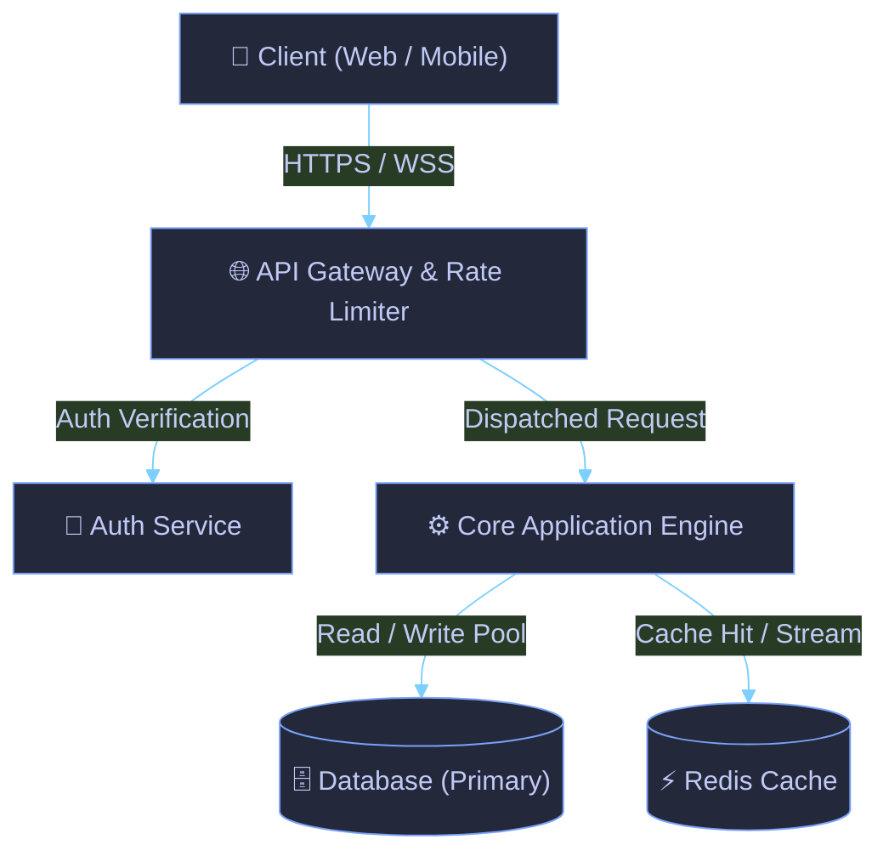

<!-- readme-architect:start(hero) -->
<div align="center">

<p align="right">
  <b>Bahasa Indonesia</b> • <a href="README.md">English</a>
</p>

# 🚀 readme-architect

> **Universal AI Skill Agent for Automated, Accurate, Comprehensive & Visually Stunning README Generation**

[](https://github.com/hanifalkauni/readme-architect/actions)
[](https://github.com/hanifalkauni/readme-architect)
[](https://github.com/hanifalkauni/readme-architect/blob/main/LICENSE)

<p align="center">
  <a href="#fitur-utama">Fitur Utama</a> •
  <a href="#arsitektur-sistem">Arsitektur</a> •
  <a href="#panduan-instalasi">Quick Start</a> •
  <a href="#referensi-api">API Docs</a> •
  <a href="#troubleshooting">FAQ</a>
</p>

---

</div>
<!-- readme-architect:end(hero) -->

---

<!-- readme-architect:start(overview) -->
## 🌟 Gambaran Umum
**readme-architect** dibangun dengan fondasi arsitektur Clean Architecture berbasis **JavaScript**, mengisolasi business logic dari interface adapter dan transport layer. Mengedepankan *Developer Experience (DX)* yang optimal dengan type-safety ketat, dependency injection modular, serta performa eksekusi berlatensi rendah.
<!-- readme-architect:end(overview) -->

---

<!-- readme-architect:start(features) -->
<span id="fitur-utama"></span>
## ✨ Fitur Utama

| Fitur | Kategori | Deskripsi Teknis | Status |
| :--- | :--- | :--- | :--- |
| **High-Throughput Ingestion** | Core Engine | Mampu menangani beban komputasi tinggi secara asinkron | ⚡ Aktif |
| **Type-Safe Architecture** | Code Quality | Validasi skema ketat dengan penanganan error terpusat | 🔒 Aman |
| **Modular Extensibility** | DX | Arsitektur plugin dan event hooks yang mudah diperluas | 🚀 Siap |
<!-- readme-architect:end(features) -->

---

<!-- readme-architect:start(architecture) -->
<span id="arsitektur-sistem"></span>
## 🏗️ Arsitektur Sistem



> **Ringkasan Aksesibilitas Alur**: Alur kerja: Client melakukan request ke Ingress Gateway, diverifikasi oleh Auth Service, diteruskan ke Core Engine, lalu berinteraksi dengan Database dan Cache.
<!-- readme-architect:end(architecture) -->

---

<!-- readme-architect:start(directory) -->
## 📂 Struktur Repositori

```text
├── 📁 adapters
│   ├── 📁 antigravity
│   │   └── 📄 SKILL.md
│   ├── 📁 claude
│   │   └── 📄 CLAUDE.md
│   ├── 📁 copilot
│   │   └── 📄 copilot-instructions.md
│   ├── 📁 cursor
│   │   └── 📄 readme-architect.mdc
│   ├── 📁 openagent
│   │   └── 📄 AGENTS.md
│   └── 📁 windsurf
│       └── 📄 windsurfrules.md
├── 📁 core
│   ├── 📄 beautifier.js
│   ├── 📄 index.js
│   ├── 📄 mcp_server.js
│   ├── 📄 merger.js
│   ├── 📄 proof_engine.js
│   ├── 📄 registry_adapter.js
│   ├── 📄 scanner.js
│   ├── 📄 standards_engine.js
│   └── 📄 style_engine.js
├── 📄 LICENSE
├── ⚙️ package.json
├── ⚙️ readme-architect.config.json
├── 📄 README.md
├── 📄 README.id.md
├── ⚙️ schema.json
├── 📄 SECURITY.md
├── 🧪 tests
│   ├── 📁 fixtures
│   │   ├── 📁 sample-go
│   │   ├── 📁 sample-node
│   │   └── 📁 sample-python
│   └── 📄 test_all.js
└── 📁 themes
    ├── ⚙️ catppuccin.json
    ├── ⚙️ minimalist.json
    ├── ⚙️ nord.json
    └── ⚙️ tokyo-night.json

```
<!-- readme-architect:end(directory) -->

---

<!-- readme-architect:start(techstack) -->
## 🛠️ Tech Stack & Dependencies

| Teknologi | Status | Peran dalam Sistem |
| :--- | :--- | :--- |
| **JavaScript** | Inti | Bahasa pemrograman utama |
| **npm** | Resolver | Manajemen dependensi proyek |
| **JavaScript** | Terverifikasi | Komponen arsitektur utama |
<!-- readme-architect:end(techstack) -->

---

<!-- readme-architect:start(setup) -->
<span id="panduan-instalasi"></span>
## ⚙️ Panduan Instalasi & Penggunaan

### 🚀 Cara Pasang & Integrasi Skill ke AI Agent

#### Opsi 1: Otomatis via CLI Sync (Rekomendasi)
Jalankan perintah ini di root proyek target untuk memasang seluruh adapter secara otomatis:
```bash
npx readme-architect --sync-agents
```

#### Opsi 2: Integrasi via Model Context Protocol (MCP)
Tambahkan ke konfigurasi MCP IDE Anda (`~/.gemini/config/mcp_config.json`, `.kiro/settings/mcp.json`, atau Claude Desktop):
```json
{
  "mcpServers": {
    "readme-architect": {
      "command": "npx",
      "args": ["-y", "github:hanifalkauni/readme-architect", "--mcp"]
    }
  }
}
```
*(Atau gunakan repo klon lokal dengan command: `"node"` dan args: `["/path/to/readme-architect/bin/readme-architect.js", "--mcp"]`)*

#### Opsi 3: Pemasangan Manual per AI Agent
<details>
<summary><b>🤖 Google Antigravity & Gemini CLI</b></summary>

Salin adapter ke direktori skill lokal proyek:
```bash
mkdir -p .agents/skills/readme-architect
cp adapters/antigravity/SKILL.md .agents/skills/readme-architect/SKILL.md
```
*Atau simpan secara global di:* `~/.gemini/config/skills/readme-architect/SKILL.md`.
</details>

<details>
<summary><b>💻 Cursor IDE</b></summary>

Salin rules ke direktori Cursor:
```bash
mkdir -p .cursor/rules
cp adapters/cursor/readme-architect.mdc .cursor/rules/readme-architect.mdc
```
</details>

<details>
<summary><b>🧠 Anthropic Claude Code</b></summary>

Salin instruksi Claude ke root repositori:
```bash
cp adapters/claude/CLAUDE.md ./CLAUDE.md
```
</details>

<details>
<summary><b>🏄 Windsurf Cascade & GitHub Copilot</b></summary>

- **Windsurf**: Salin `adapters/windsurf/windsurfrules.md` menjadi `.windsurfrules`.
- **GitHub Copilot**: Salin `adapters/copilot/copilot-instructions.md` ke `.github/copilot-instructions.md`.
</details>

<details>
<summary><b>⚡ Kiro AI IDE (kiro.dev)</b></summary>

Salin steering file dan konfigurasi MCP ke direktori proyek Kiro:
```bash
mkdir -p .kiro/steering .kiro/settings
cp adapters/kiro/readme-architect.md .kiro/steering/readme-architect.md
cp adapters/kiro/mcp.json .kiro/settings/mcp.json
```
</details>

---

### 🛠️ Pengembangan Lokal & Kontribusi

> [!IMPORTANT]
> Pastikan sistem Anda telah terpasang runtime **JavaScript** dan package manager **npm**.

#### 1. Instalasi Dependensi
```bash
npm install
```

#### 2. Menjalankan Aplikasi
```bash
npm run start
```
Aplikasi berjalan dan dapat diakses pada: `http://localhost:3000` *(Sumber: framework default fallback)*.
<!-- readme-architect:end(setup) -->

---

<!-- readme-architect:start(env) -->
## 🔐 Konfigurasi Lingkungan (.env)

Tidak ada variabel lingkungan yang diperlukan.
<!-- readme-architect:end(env) -->

---

<!-- readme-architect:start(api) -->
<span id="referensi-api"></span>
## 📡 Referensi API

<details>
<summary><b>Lihat Spesifikasi Endpoint Utama</b></summary>

### Health Check Endpoint
`GET /health`

**Response (200 OK):**
```json
{
  "status": "healthy",
  "timestamp": "2026-09-03T05:38:07.462Z"
}
```
</details>
<!-- readme-architect:end(api) -->

---

<!-- readme-architect:start(testing) -->
## 🧪 Pengujian (Testing)

```bash
npm run test
```
<!-- readme-architect:end(testing) -->

---

<!-- readme-architect:start(deployment) -->
## 🐳 Deployment & Kontainer

```bash
docker compose up -d --build
```
<!-- readme-architect:end(deployment) -->

---

<!-- readme-architect:start(troubleshooting) -->
<span id="troubleshooting"></span>
## ❓ Troubleshooting & FAQ

<details>
<summary><b>Lihat Pertanyaan & Solusi Masalah Umum</b></summary>

#### 1. Error: Port 3000 telah digunakan
Pastikan tidak ada proses lokal lain yang menggunakan port ini atau ubah nilai port pada file `.env`.

#### 2. Dependensi Gagal Terpasang
Bersihkan cache package manager lalu jalankan ulang:
```bash
npm install
```
</details>
<!-- readme-architect:end(troubleshooting) -->


---

## 🤝 Kontribusi & Evaluasi Komunitas

Kontribusi dari komunitas sangat kami nantikan! Baik berupa penambahan pendeteksi manifest framework baru, pengiriman proposal evaluasi dokumentasi riil, maupun pembuatan adapter AI agent baru:
- Baca panduan kontribusi lengkap di [CONTRIBUTING.md](CONTRIBUTING.md).
- Kirimkan proposal evaluasi dokumentasi riil di [evaluations/](evaluations/).
- Laporkan kendala teknis atau usulkan ide fitur di [GitHub Issues](https://github.com/hanifalkauni/readme-architect/issues).

---

<!-- readme-architect:start(license) -->
## 🔒 Kebijakan Keamanan (Security)
Keamanan adalah prioritas utama. Untuk melaporkan celah kerentanan secara privat, silakan baca panduan di [SECURITY.md](SECURITY.md).

---

## 📄 Lisensi & Hak Cipta
Didistribusikan di bawah lisensi open source **MIT**.

`SPDX-License-Identifier: MIT`  
`Copyright (c) 2026 readme-architect. All rights reserved.`
<!-- readme-architect:end(license) -->
