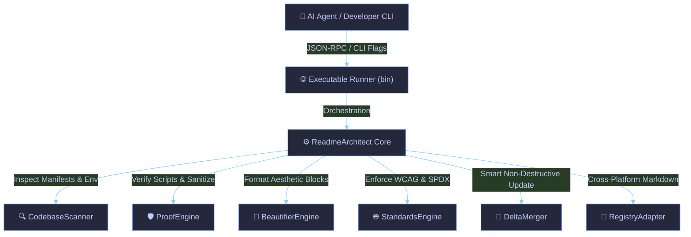

<!-- readme-architect:start(hero) -->
<div align="center">

<p align="right">
  <a href="README.id.md">Bahasa Indonesia</a> • <b>English</b>
</p>

# 🚀 readme-architect

> **Universal AI Skill Agent for Automated, Accurate, Comprehensive & Visually Stunning README Generation**

[](https://github.com/hanifalkauni/readme-architect/actions)
[](https://github.com/hanifalkauni/readme-architect)
[](https://github.com/hanifalkauni/readme-architect/blob/main/LICENSE)

<p align="center">
  <a href="#key-features">Key Features</a> •
  <a href="#system-architecture">Architecture</a> •
  <a href="#quick-start">Quick Start</a> •
  <a href="#api-reference">API Docs</a> •
  <a href="#troubleshooting">FAQ</a>
</p>

---

</div>
<!-- readme-architect:end(hero) -->

---

<!-- readme-architect:start(overview) -->
## 🌟 Overview
**readme-architect** is engineered on Clean Architecture principles powered by **JavaScript**, isolating core domain business logic from interface adapters and transport layers. It prioritizes optimal *Developer Experience (DX)* with zero external dependencies, rigorous type-safety, anti-hallucination command proofing, and low-latency execution.
<!-- readme-architect:end(overview) -->

---

<!-- readme-architect:start(features) -->
<span id="key-features"></span>
## ✨ Key Features

| Feature | Category | Technical Description | Status |
| :--- | :--- | :--- | :--- |
| **Zero-Hallucination ProofEngine** | Core Engine | Strictly verifies terminal scripts against real physical manifests | ⚡ Active |
| **Secret Sanitization** | Security | Automatic masking of AWS keys, JWTs, and API credentials via Shannon Entropy | 🔒 Secure |
| **12 Writing Style Personas** | DX & Tone | Tailored documentation styles (Developer-Centric, Showcase, API-First, Academic, etc.) | 🚀 Ready |
| **Standards & Accessibility** | Compliance | Enforces WCAG 2.2 AA alt-text, Mermaid screen-reader fallback, and SPDX 3.0 | 🌐 Verified |
| **Model Context Protocol (MCP)** | AI Protocol | Native stdio JSON-RPC 2.0 server for Antigravity, Claude, Cursor, and Windsurf | 🤖 Ready |
<!-- readme-architect:end(features) -->

---

<!-- readme-architect:start(architecture) -->
<span id="system-architecture"></span>
## 🏗️ System Architecture



> **Accessibility Flow Summary**: Workflow diagram: AI Agent / CLI initiates request to Runner, orchestrating Scanner, ProofEngine, Beautifier, Standards, DeltaMerger, and RegistryAdapter to generate accessible Markdown.
<!-- readme-architect:end(architecture) -->

---

<!-- readme-architect:start(directory) -->
## 📂 Repository Structure

```text
├── 📁 adapters
│   ├── 📁 antigravity
│   │   └── 📄 SKILL.md
│   ├── 📁 claude
│   │   └── 📄 CLAUDE.md
│   ├── 📁 copilot
│   │   └── 📄 copilot-instructions.md
│   ├── 📁 cursor
│   │   └── 📄 readme-architect.mdc
│   ├── 📁 openagent
│   │   └── 📄 AGENTS.md
│   └── 📁 windsurf
│       └── 📄 windsurfrules.md
├── 📁 core
│   ├── 📄 beautifier.js
│   ├── 📄 index.js
│   ├── 📄 mcp_server.js
│   ├── 📄 merger.js
│   ├── 📄 proof_engine.js
│   ├── 📄 registry_adapter.js
│   ├── 📄 scanner.js
│   ├── 📄 standards_engine.js
│   └── 📄 style_engine.js
├── 📄 LICENSE
├── ⚙️ package.json
├── ⚙️ readme-architect.config.json
├── 📄 README.md
├── 📄 README.id.md
├── ⚙️ schema.json
├── 📄 SECURITY.md
├── 🧪 tests
│   ├── 📁 fixtures
│   │   ├── 📁 sample-go
│   │   ├── 📁 sample-node
│   │   └── 📁 sample-python
│   └── 📄 test_all.js
└── 📁 themes
    ├── ⚙️ catppuccin.json
    ├── ⚙️ minimalist.json
    ├── ⚙️ nord.json
    └── ⚙️ tokyo-night.json

```
<!-- readme-architect:end(directory) -->

---

<!-- readme-architect:start(techstack) -->
## 🛠️ Tech Stack & Dependencies

| Technology | Status | Role in Architecture |
| :--- | :--- | :--- |
| **Node.js (ES Modules)** | Core | Native runtime environment (>= 18.0.0) |
| **Zero Dependencies** | Verified | 100% pure standard library, 0 third-party packages |
| **Model Context Protocol** | Interface | JSON-RPC 2.0 stdio specification |
| **JSON Schema (Draft-07)** | Config | Complete IDE validation & IntelliSense autocomplete |
<!-- readme-architect:end(techstack) -->

---

<!-- readme-architect:start(setup) -->
<span id="quick-start"></span>
## ⚙️ Installation & Usage Guide

### 🚀 Integrating Skills with AI Agents

#### Option 1: Automatic via CLI Sync (Recommended)
Run this command in any target project root to export all agent adapters automatically:
```bash
npx github:hanifalkauni/readme-architect --sync-agents
```

#### Option 2: Integration via Model Context Protocol (MCP)
Add this to your IDE MCP configuration (`~/.gemini/config/mcp_config.json`, `.kiro/settings/mcp.json`, or Claude Desktop):
```json
{
  "mcpServers": {
    "readme-architect": {
      "command": "npx",
      "args": ["-y", "github:hanifalkauni/readme-architect", "--mcp"]
    }
  }
}
```
*(Or if running from a local clone, use command: `"node"` and args: `["/path/to/readme-architect/bin/readme-architect.js", "--mcp"]`)*

#### Option 3: Manual Installation per AI Agent
<details>
<summary><b>🤖 Google Antigravity & Gemini CLI</b></summary>

Copy adapter to local workspace skill directory:
```bash
mkdir -p .agents/skills/readme-architect
cp adapters/antigravity/SKILL.md .agents/skills/readme-architect/SKILL.md
```
*Or install globally at:* `~/.gemini/config/skills/readme-architect/SKILL.md`.
</details>

<details>
<summary><b>💻 Cursor IDE</b></summary>

Copy rules to Cursor directory:
```bash
mkdir -p .cursor/rules
cp adapters/cursor/readme-architect.mdc .cursor/rules/readme-architect.mdc
```
</details>

<details>
<summary><b>🧠 Anthropic Claude Code</b></summary>

Copy instructions to repository root:
```bash
cp adapters/claude/CLAUDE.md ./CLAUDE.md
```
</details>

<details>
<summary><b>🏄 Windsurf Cascade & GitHub Copilot</b></summary>

- **Windsurf**: Copy `adapters/windsurf/windsurfrules.md` to `.windsurfrules`.
- **GitHub Copilot**: Copy `adapters/copilot/copilot-instructions.md` to `.github/copilot-instructions.md`.
</details>

<details>
<summary><b>⚡ Kiro AI IDE (kiro.dev)</b></summary>

Copy steering file and MCP configuration to your Kiro project:
```bash
mkdir -p .kiro/steering .kiro/settings
cp adapters/kiro/readme-architect.md .kiro/steering/readme-architect.md
cp adapters/kiro/mcp.json .kiro/settings/mcp.json
```
</details>

---

### 🛠️ Local Development & CLI Usage

> [!IMPORTANT]
> Ensure your system has **Node.js (>= 18.0.0)** and **npm** installed.

#### 1. Dependency Installation
```bash
npm install
```

#### 2. Running Commands Directly
```bash
# Generate README with Developer-Centric persona & Tokyo Night theme
node bin/readme-architect.js --style developer-centric --theme tokyo-night

# Run compliance audit (WCAG 2.2 AA & Anti-Hallucination)
node bin/readme-architect.js --verify
```
<!-- readme-architect:end(setup) -->

---

<!-- readme-architect:start(env) -->
## 🔐 Environment Configuration (.env)

No environment variables are required. Pure zero-config execution.
<!-- readme-architect:end(env) -->

---

<!-- readme-architect:start(api) -->
<span id="api-reference"></span>
## 📡 API & MCP Tools Reference

<details>
<summary><b>View Exposed MCP Tools & Specifications</b></summary>

### 1. `inspect_codebase`
Scans codebase manifests, detects frameworks, verifies execution scripts, and sanitizes secrets.

### 2. `generate_readme`
Generates comprehensive 14-section accessible README based on selected style, theme, and registry.

### 3. `validate_readme_compliance`
Runs automated 4-point verification audit (WCAG 2.2 AA, SPDX 3.0, Mermaid fallback, anti-hallucination).

### 4. `beautify_readme`
Enhances existing markdown with themed Hero Header, badges, collapsible sections, and Unicode trees.
</details>
<!-- readme-architect:end(api) -->

---

<!-- readme-architect:start(testing) -->
## 🧪 Testing Suite

```bash
npm test
```
Runs 22 comprehensive unit and integration suites covering Scanner, ProofEngine, Link Integrity, Styles, Standards, Beautifier, Merger, and E2E generation.
<!-- readme-architect:end(testing) -->

---

<!-- readme-architect:start(deployment) -->
## 🐳 Deployment & Containerization

```bash
docker compose up -d --build
```
<!-- readme-architect:end(deployment) -->

---

<!-- readme-architect:start(troubleshooting) -->
<span id="troubleshooting"></span>
## ❓ Troubleshooting & FAQ

<details>
<summary><b>View Common Questions & Solutions</b></summary>

#### 1. How do I switch themes?
Use the `--theme` CLI flag or configure `theme` in `readme-architect.config.json`. Available themes: `tokyo-night`, `catppuccin`, `nord`, `minimalist`.

#### 2. Will regenerating overwrite my manual edits?
No. README-Architect features a **Smart Delta Merger** engine that preserves any user notes wrapped in `<!-- user-content -->` and updates only architect-managed blocks.
</details>
<!-- readme-architect:end(troubleshooting) -->

---

<!-- readme-architect:start(license) -->
## 🔒 Security Policy
Security is our top priority. To responsibly report vulnerabilities, please refer to [SECURITY.md](SECURITY.md).

---

## 📄 License & Copyright
Distributed under the open-source **MIT** License.

`SPDX-License-Identifier: MIT`  
`Copyright (c) 2026 readme-architect. All rights reserved.`
<!-- readme-architect:end(license) -->