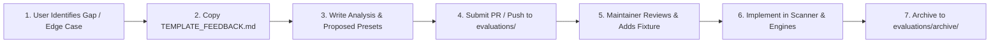
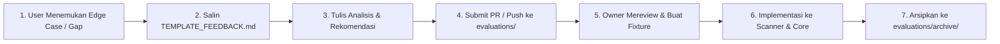

# 📋 Evaluation & Feedback Hub — README-Architect

<p align="center">
  <a href="#-english"><b>English</b></a> •
  <a href="#-bahasa-indonesia"><b>Bahasa Indonesia</b></a>
</p>

---

## 🌐 English

Welcome to the **Evaluation & Feedback Hub** of `readme-architect`. This directory serves as a structured collaboration bridge between community users (*developers/maintainers*) and project contributors.

When using the `readme-architect` AI skill or MCP server on real-world multi-language repositories and encountering cases where technology stack detection is incomplete, directory trees miss nested modules, or documentation aesthetics/compliance can be enhanced, you can document and submit your evaluation RFC here.

### 🔄 Evaluation Workflow



#### 1. For Users & Contributors:
1. Copy the evaluation template [`TEMPLATE_FEEDBACK.md`](./TEMPLATE_FEEDBACK.md).
2. Name your proposal file descriptively, for example:
   - `evaluations/FEEDBACK_ELIXIR_PHOENIX_SCANNER.md`
   - `evaluations/FEEDBACK_KUBERNETES_HELM_DOCS.md`
   - `evaluations/FEEDBACK_MONOREPO_TURBOREPO_TREE.md`
3. Fill out the sections:
   - **Executive Summary**: Tested project type, package manager, and manifest files.
   - **Characteristics vs Gaps**: Actual codebase structure vs what `readme-architect` detected.
   - **Tuning Recommendations**: Regex/manifest patterns in `core/scanner.js` or formatting rules in `core/beautifier.js`.
   - **Expected Ideal Output**: Expected README Markdown layout.
4. Submit a Pull Request (PR) or open an issue referencing the file.

#### 2. For Repository Maintainers:
1. Review the incoming evaluation document and analyze the detection or styling gap.
2. Build a representative test fixture in `tests/fixtures/` using mock manifests.
3. Apply required scanner triggers, proof rules, or style templates.
4. Run `npm test` to verify that 100% of unit and regression tests pass (27+ tests).
5. Move the fulfilled evaluation proposal into [`evaluations/archive/`](./archive/) as an immutable reference of continuous improvement.

### 📂 Directory Layout

```
evaluations/
├── README.md                 # Bilingual guide (this file)
├── TEMPLATE_FEEDBACK.md      # Reusable RFC template for submitting evaluations
└── archive/                  # Fulfilled and verified evaluation proposals
    └── CASE_01_COMPLIANCE_AND_BEAUTIFY_TUNING.md # Real-world MCP compliance & beautifier tuning
```

### 🌟 Gold Standard Reference

Check out our successfully fulfilled evaluation study case:  
👉 [`evaluations/archive/CASE_01_COMPLIANCE_AND_BEAUTIFY_TUNING.md`](./archive/CASE_01_COMPLIANCE_AND_BEAUTIFY_TUNING.md)  
*(Includes strict link sanitization, SPDX 3.0 license validation, and non-destructive header beautification).*

---

## 🇮🇩 Bahasa Indonesia

Selamat datang di **Evaluation & Feedback Hub** `readme-architect`. Direktori ini dirancang khusus sebagai jembatan kolaborasi terstruktur antara pengguna (*developers/maintainers*) dan pemelihara repositori (*maintainers*).

Ketika Anda menggunakan skill atau MCP `readme-architect` pada repositori proyek nyata dan menemukan kasus di mana deteksi teknologi belum lengkap, struktur direktori melewatkan submodule monorepo, atau standar estetika dan kepatuhan (compliance) bisa ditingkatkan, Anda dapat mendokumentasikan dan mengirimkan evaluasi RFC Anda di sini.

### 🔄 Alur Kerja Evaluasi (Workflow)



#### 1. Untuk Pengguna / Kontributor:
1. Salin template evaluasi [`TEMPLATE_FEEDBACK.md`](./TEMPLATE_FEEDBACK.md).
2. Beri nama file baru yang deskriptif, contoh:
   - `evaluations/FEEDBACK_ELIXIR_PHOENIX_SCANNER.md`
   - `evaluations/FEEDBACK_KUBERNETES_HELM_DOCS.md`
   - `evaluations/FEEDBACK_MONOREPO_TURBOREPO_TREE.md`
3. Isi analisis sesuai petunjuk di template:
   - **Executive Summary**: Tipe project yang diuji, package manager, dan manifest dependencies.
   - **Karakteristik Kode Riil vs Gap**: Struktur repositori sebenarnya vs bagian yang terlewat oleh engine.
   - **Rekomendasi Tuning Teknis**: Usulan pattern di `core/scanner.js`, `core/beautifier.js`, atau `core/compliance.js`.
   - **Ekspektasi Output Ideal**: Tata letak Markdown README yang diharapkan.
4. Buat Pull Request (PR) atau sampaikan proposal evaluasi tersebut ke maintainer.

#### 2. Untuk Repository Owner / Maintainer:
1. Pelajari dokumen evaluasi yang masuk dan pahami letak kesenjangannya.
2. Buat fixture uji representatif di `tests/fixtures/` dengan mock manifest terkait.
3. Terapkan penyesuaian pada modul scanner atau beautifier.
4. Jalankan `npm test` untuk memastikan *zero regression* (seluruh 27+ test lulus).
5. Pindahkan dokumen evaluasi yang selesai diimplementasikan ke dalam [`evaluations/archive/`](./archive/) sebagai riwayat kematangan fitur.

### 📂 Struktur Direktori

```
evaluations/
├── README.md                 # Panduan dwibahasa (file ini)
├── TEMPLATE_FEEDBACK.md      # Template RFC siap pakai untuk membuat evaluasi baru
└── archive/                  # Arsip evaluasi yang telah sukses diimplementasikan
    └── CASE_01_COMPLIANCE_AND_BEAUTIFY_TUNING.md # Kasus tuning compliance & beautifier
```

### 🌟 Contoh Standar Emas (Reference Example)

Lihat studi kasus riil yang telah sukses diimplementasikan sebagai acuan:  
👉 [`evaluations/archive/CASE_01_COMPLIANCE_AND_BEAUTIFY_TUNING.md`](./archive/CASE_01_COMPLIANCE_AND_BEAUTIFY_TUNING.md)  
*(Mencakup validasi broken links, audit SPDX 3.0, dan perbaikan beautifier hero header).*
